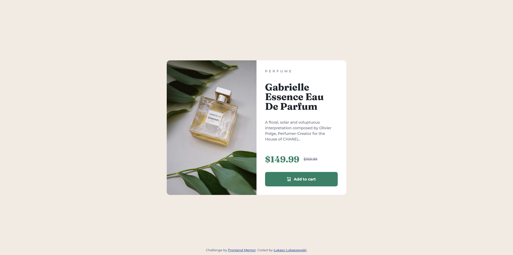

# Frontend Mentor - Product preview card component solution

This is a solution to the [Product preview card component challenge on Frontend Mentor](https://www.frontendmentor.io/challenges/product-preview-card-component-GO7UmttRfa). Frontend Mentor challenges help you improve your coding skills by building realistic projects. 

## Table of contents

- [Frontend Mentor - Product preview card component solution](#frontend-mentor---product-preview-card-component-solution)
  - [Table of contents](#table-of-contents)
  - [Overview](#overview)
    - [The challenge](#the-challenge)
    - [Screenshot](#screenshot)
    - [Links](#links)
  - [My process](#my-process)
    - [Built with](#built-with)
    - [What I learned](#what-i-learned)
    - [Continued development](#continued-development)
    - [Useful resources](#useful-resources)
  - [Author](#author)
  - [Acknowledgments](#acknowledgments)

**Note: Delete this note and update the table of contents based on what sections you keep.**

## Overview

### The challenge

Users should be able to:

- View the optimal layout depending on their device's screen size
- See hover and focus states for interactive elements

### Screenshot



### Links

- Solution URL: [Frontend Mentor solution](https://www.frontendmentor.io/solutions/product-preview-card-using-html-and-css-with-a-mobilefirst-approach-KaWWZZ7evL)
- Live Site URL: [Github Pages](https://luckyszakul0.github.io/Front-mentor-product-card/)

## My process

1. I took the mobile-first approach to this challenge.
2. I've done the majority of HTML first, only adding minor things to it later, like the desktop source for picture tag or class names.
3. Then, I've done the CSS while adding some comments and added CSS reset and a special class for elements that make it easier to use screen readers. Creators of those things are credited in the comments in the code.
4. After that I done the desktop design with a @media query.
### Built with

- Vanilla HTML and CSS
- Semantic HTML5 markup
- CSS custom properties
- Flexbox
- CSS Grid
- Mobile-first workflow

### What I learned

During this challenge I mainly polished my CSS and HTML skills a little bit.  
Also, I learned some semantic tags in HTML and the picture and source tags. In CSS I used more rems and ems than usual. When I started learning those languages I picked up a habit of sizing everything with pixels and sometimes percents, so the rems and ems skill might come in handy.

```html
<picture>
    <source media="(min-width: 675px)" srcset="images/image-product-desktop.jpg">
    
</picture>
```

### Continued development

In future projects I plan to learn some more CSS and start Tailwind learning.  
If JS is needed I will use jQuery as I'm learning it at the moment. If I will adapt any framework in the future I think it will be Svelte but it's a distant future.

### Useful resources

- [Visually-hidden class from www.scottohara.me blog](https://www.scottohara.me/blog/2017/04/14/inclusively-hidden.html) - A really nice CSS class that can be used when doing HTML markup that can be helpful for screen readers but shouldn't show up on a website.
- [CSS Reset from www.joshwcomeau.com](https://www.joshwcomeau.com/css/custom-css-reset) - Helpful and work-easing CSS Reset. It thinks about many things making CSS better to work with on many planes of development.

## Author

- GitHub - [Łukasz Lubaszewski](https://github.com/luckyszakul0)
- Frontend Mentor - [@Lukasz710](https://www.frontendmentor.io/profile/Lukasz710)

## Acknowledgments

Kevin Powell's video [Taking on a Frontend Mentor challenge | Responsive Product Preview Card Component](https://www.youtube.com/watch?v=B2WL6KkqhLQ) on this Frontend Mentor challenge really helped me with optimizing it and adding some semantics to the HTML. I also got to know the resources listed in the [Useful resources](#useful-resources) section.